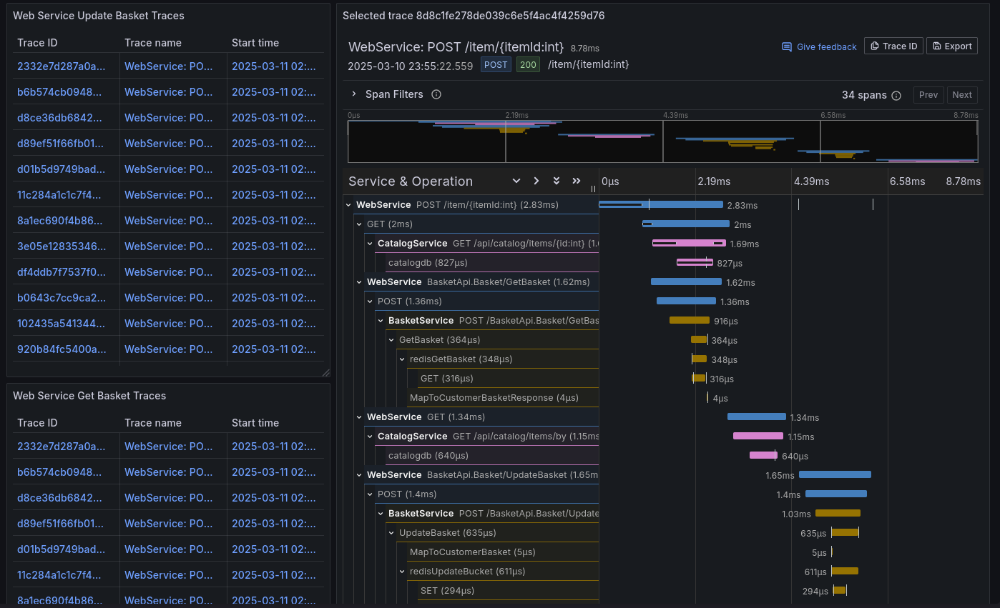

# First Assignment - AS  

## Assignment Goal  

The objective of this assignment is to **implement observability** using OpenTelemetry. The key goals include:  

- Tracing a user action throughout the application  
- Collecting and analyzing application metrics  
- Setting up a **Grafana dashboard** to visualize traces and metrics  

---

## Implemented Features  

Observability has been integrated into the **basket update workflow**, which includes:  

- Retrieving the product catalog  
- Fetching the user's basket  
- Updating the basket with new items  

This ensures **better monitoring, debugging, and performance analysis** across multiple services.  

## Architecture of the system


---

## Technology Stack  

Observability is implemented using **OpenTelemetry, Jaeger, Prometheus, the OpenTelemetry Collector, and Grafana**.  

### 🔹 OpenTelemetry  
- Used as the **primary instrumentation** tool to collect traces and metrics from various services.  

### 🔹 Jaeger  
- Captures and visualizes **distributed traces**, allowing us to track requests across services.  

### 🔹 Prometheus  
- A **time-series database** responsible for storing and querying system metrics.  

### 🔹 OpenTelemetry Collector  
- Aggregates and exports telemetry data from OpenTelemetry **to Prometheus** for further analysis.  

### 🔹 Grafana  
- Provides a **dashboard interface** where traces and metrics are visualized for analysis and monitoring.  

### Grafana Dashboard
#### metrics

#### traces


## How to run
1 - run docker compose
```bash
docker compose up --build
```
2 - execute services
```bash
dotnet run --project src/eShop.AppHost/eShop.AppHost.csproj 
```
3 - configure grafana
 - add data sources
 ```
 Prometheus - http://prometeus:9090
 Jaeger - http://Jaeger:16686
 ```
 - load json dashboard
 ```
 grafana/dashboards/grafana.json
 ```
